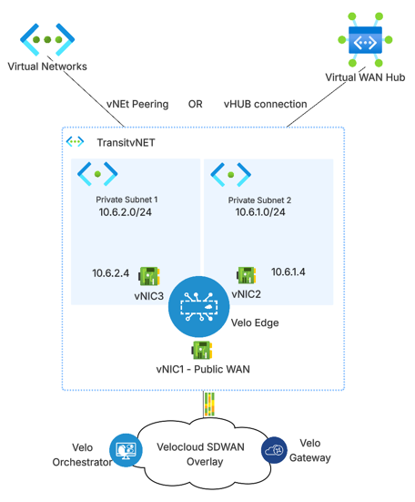
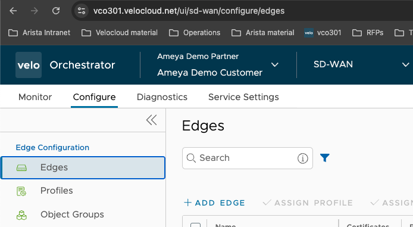
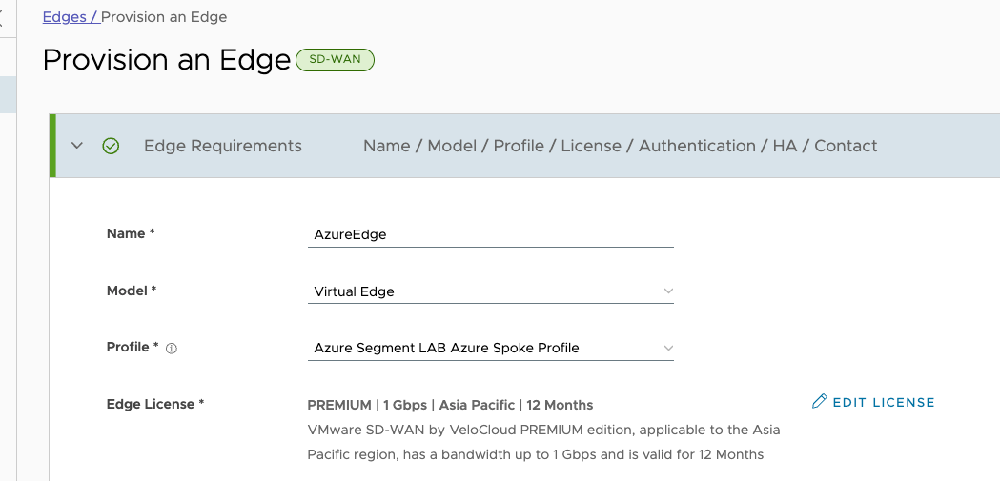
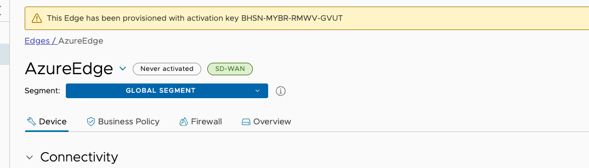
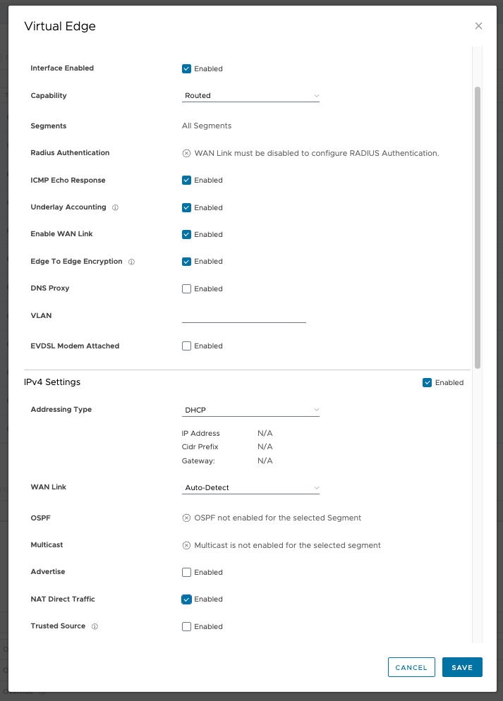
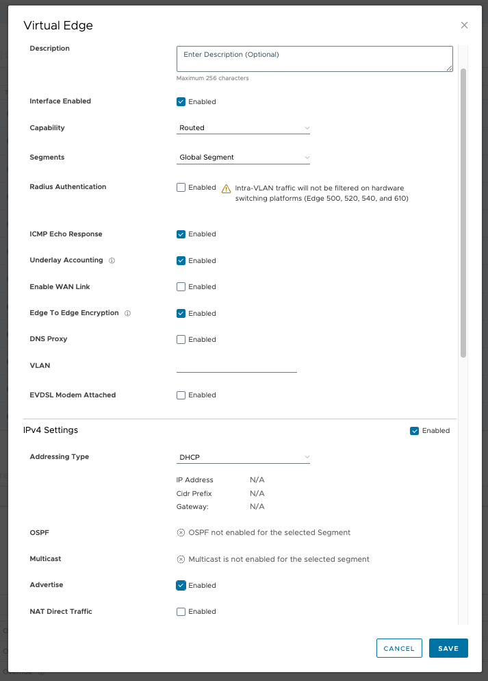

**Deploying a Velocloud SD-WAN Edge in Azure using Terraform**

```
Author: Ameya Oke
Email: ameya@arista.com
Version: 1.0
Date: 13/03/2026
```

## Overview
This document describes how to deploy a **Velocloud SD-WAN Virtual Edge** in Microsoft Azure using **Terraform**.
The deployment automates the creation of:
* Azure Resource Group
* Transit Virtual Network where virtual edge will get deployed (VNet)
* Public and Private Subnets for the different networks connected to virtual edge
* Network Security Group to allow virtual edge to connect to VCO(MP) and VCG(CP) and build SDWAN tunnels.
* Public IP for WAN interface of virtual Edge
* Velocloud SD-WAN Virtual Edge VM
* Automatic activation using **cloud-init**

# Architecture
The deployment creates the following topology:

 


Interface mapping:

| Interface | Purpose               | Subnet           |
| --------- | --------------------- | ---------------- |
| ge1       | WAN / Internet access | Public Subnet    |
| ge2       | LAN Segment 1         | Private Subnet 1 |
| ge3       | LAN Segment 2         | Private Subnet 2 |


```
Note:
You can place the GE2 and GE3 interfaces in separate segments/VRFs if end-to-end segmentation is required.
If additional segments are needed, you can modify the Terraform template to add more vNICs and map each to separate segments/vNETs, with corresponding Azure vNETs configured on the backend.

```


# Prerequisites

Before deployment ensure the following requirements are met.

## 1 Terraform Installed
Install Terraform and setup Azure environment variables:
```
https://developer.hashicorp.com/terraform/tutorials/azure-get-started/install-cli
https://developer.hashicorp.com/terraform/tutorials/azure-get-started/azure-build

```

```bash
terraform version
```
---

## 2 Azure CLI Installed and Authenticated

Install Azure CLI:

```
https://learn.microsoft.com/en-us/cli/azure/install-azure-cli
```

Login to Azure:

```bash
az login
```

Set the correct subscription:

```bash
az account set --subscription <subscription-id>
```

---

## 3 Azure Marketplace Image Accepted

The VMware SD-WAN image must be accepted in the Azure marketplace.

```bash
az vm image terms accept \
--publisher arista-networks  \
--offer velocloud-virtual-edge \
--plan velocloud_edge_6101
```

---

## 4 Create an Edge on Velocloud orchestrator

1. Login into the Orchestrator and add the virtual edge to the Enterprise.
a. In the Orchestrator, go to Configure > Edges and click the **Add Edge** button.



b. The Provision New Edge dialog box displays.



c. In the Provision New Edge dialog, provide the required details and click Save:
1. Enter a name in the Name text box.
2. From the Model drop-down menu, choose Virtual Edge.
3. From the Profile drop-down menu, choose a Profile.
4. Select a license

The Edge is provisioned with an activation key, as shown in the following image. 
Make a note of this activation key.



2. Configure virtual edge interfaces.
a. Navigate to the virtual edge’s Device Settings tab.
b. Change the Interface Settings as follows:

1. Change the GE1 interface capability from “Switched” to “Routed” (if needed) and activate DHCP
addressing and WAN overlay.

**GE1 Interface**



2. In the GE2 and GE3 interface, deactivate WAN overlay as this interface will be used for the LAN-side
Gateway. Also, deactivate Network Address Translation (NAT) Direct Traffic.

**GE2 Interface**



**GE3 Interface**


You must have:

| Parameter           | Example             |
|---------------------|---------------------|
| VCO FQDN            | xyz.velocloud.net   |
| Edge Activation Key | XXXX-XXXX-XXXX-XXXX |
| Edge Name           | AzureEdge           |

---

# Deployment Parameters

The Terraform template uses variables to simplify customization.

| Variable               | Description    | Default         |
| ---------------------- | -------------- | --------------- |
| location               | Azure region   | AustraliaEast   |
| resource_group_name    | Resource group | velocloud-rg    |
| virtual_machine_size   | VM size        | Standard_DS3_v2 |
| vnet_prefix            | VNET CIDR      | 10.6.0.0/16     |
| public_subnet_prefix   | WAN subnet     | 10.6.0.0/24     |
| private_subnet1_prefix | LAN subnet 1   | 10.6.1.0/24     |
| private_subnet2_prefix | LAN subnet 2   | 10.6.2.0/24     |
| edge_ge2_ip            | Static LAN IP  | 10.6.1.4        |
| edge_ge3_ip            | Static LAN IP  | 10.6.2.4        |

---

# Terraform Deployment

## Step 1 Git pull the repository

```bash
git clone https://github.com/ameyaarista/Velocloud-edge-terraform-templates.git
cd Velocloud-edge-terraform-templates
git pull origin main
```

---
## Step 2 Make appropriate changes to the main.tf file in order to build the correct cloud-init configuration for auto activation


```
Navigate to the ./Velocloud-edge-terraform-templates/velo_edge_azure folder and edit the **main.tf** file.

variable "activation_key" {
  default = "XXXX-XXXX-XXXX-XXXX"  --> Specify the edge activation key 
}

variable "vco" {
  default = "vco301.velocloud.net" --> Specify the VCO FQDN
}

variable "edge_name" {
  default = "AzureEdge"  --> Specify the Edge Name
}
```

---

## Step 3 - Virtual Machine Deployment

The VM is deployed using the **VMware SD-WAN Marketplace image**.

Key configuration:

```
publisher = "arista-networks"
offer     = "velocloud-virtual-edge"
sku       = "velocloud_edge_6101"
```

## Step 4 - Add SSH  key for virtual edge
You will need an SSH key first and then use it with Terraform**.

### 1. Check if you already have an SSH key

Run:

```bash
ls ~/.ssh
```

Look for a file such as:

```
id_ed25519
id_ed25519.pub
```

If it exists, you can skip this section. 
Go to "Deploy the Infrastructure" section.

---

### 2. Generate a new SSH key

Run:

```bash
ssh-keygen -t ed25519 -C "terraform-access"
```

You will see prompts like:

```
Enter file in which to save the key (/Users/username/.ssh/id_ed25519):
```

Press **Enter** to accept the default location.

Optional:

* Enter a passphrase (or press Enter to skip).

This creates:

```
~/.ssh/id_ed25519      (private key)
~/.ssh/id_ed25519.pub  (public key)
```

---

### 3. Verify the key was created

```bash
cat ~/.ssh/id_ed25519.pub
```

You should see something like:

```
ssh-ed25519 AAAAC3NzaC1lZDI1NTE5AAAAI... terraform-access
```


We will use this key as an input variable while running terraform

---


# Deploy the Infrastructure

## Initialize Terraform and format files

```bash
terraform init
terraform fmt
```

---

## Review Deployment Plan

```bash
terraform plan -var="public_key=$(cat ~/.ssh/id_ed25519.pub)"
```

---

## Apply Configuration

```bash
terraform apply -var="public_key=$(cat ~/.ssh/id_ed25519.pub)"
```

Confirm when prompted:

```
yes
```

Deployment typically takes **5-10 minutes**.

---
